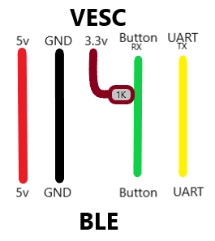

# VESC M365 Dash
Allows you to connect your XIAOMI or NINEBOT display to VESC controller.

## How
Do you want to use your Xiaomi or NineBot BLE with a VESC controller? This is the right place for you! \
Read one of the guides below to get started.

- [DE Guide](/guide/DE.md)
- [German Rollerplausch Guide](https://rollerplausch.com/threads/vesc-controller-einbau-1s-pro2-g30.6032/)

## Which version should I use?

If you are running **VESC 6.06**, use these:
- **M365**: https://github.com/m365fw/vesc_m365_dash/blob/main/m365_dash.lisp
- **G30**: https://github.com/m365fw/vesc_m365_dash/blob/main/g30_dash.lisp
- **How-To** Video: https://www.youtube.com/watch?v=kX8PsaxfoXQ

## How do I wire it?
Red to 5V \
Black to GND \
Yellow to TX (UART-HDX) \
Green to RX (Button) \
1k Ohm Resistor from 3.3V to RX (Button)

## Features
- [x] Multiple speed modes (Press twice)
- [x] Secret speed modes (Hold throttle and brake and press twice)
- [x] Lock mode with beeping and braking (Press twice while holding break)
- [x] Motor start speed feature (More secure)
- [x] Shutdown feature (Long press to turn off)
- [x] Battery Idle % on Secret Sport Mode
- [x] Temperature notification icon at 60°C

Features to be added:
- [ ] App communication
- [ ] More unlock combinations

## Fixed to be done
- [x] ~~Figure out why 0x64 packets are not being read. (on my setup)~~ (Can be ignored due to the fact that we do not have to receive any 0x64 packets to sent our own 0x64 back)
- [x] ~~Figure out why button reading is randomly~~ (can be fixed with 470R resistor between 3.3v and RX and capacitor on 3.3v+GND)

## Tested on
### BLEs
- Clone M365 PRO Dashboard ([AliExpress](https://s.click.aliexpress.com/e/_9JHFDN))
- Original DE-Edition PRO 2 Dashboard

### VESCs
- Ubox (Best choice):
    - Single Ubox 80v 100A Alu PCB ([Spintend](https://spintend.com/collections/diy-electric-skateboard-parts/products/single-ubox-aluminum-controller-80v-100a-based-on-vesc?ref=1zuna))
- 75100 Box:
    - Makerbase 75100 VESC ([AliExpress](https://s.click.aliexpress.com/e/_DmJxqxr) - 75€)
    - Flipsky 75100 VESC ([Banggood](https://banggood.onelink.me/zMT7/zmenvmm2) - with Honey Add-On about 87€)

- 75100 Alu PCB:
    - Makerbase 75100 Alu PCB ([AliExpress](https://s.click.aliexpress.com/e/_DE9TKAl) - 95€)
    - Flipsky 75100 Alu PCB ([AliExpress](https://s.click.aliexpress.com/e/_DEXNhX3) - 151€)

- 75200 Alu PCB (Top Performance):
    - Makerbase 75200 Alu PCB ([AliExpress](https://s.click.aliexpress.com/e/_Dk3ucKd) - 143€)
    - Flipsky 75200 Alu PCB ([AliExpress](https://s.click.aliexpress.com/e/_DkxlJbj) - 266€)

- More recommended VESCs:
    - MP2 300A 100V/150V VESC ([GitHub](https://github.com/badgineer/MP2-ESC) - DIY)
    - and many more... use whatever you like.

#### Requirements on VESC
Requires 6.05+ VESC firmware. \
Can be found here: https://vesc-project.com/

## Worth to check out!
https://github.com/Koxx3/SmartESC_STM32_v2 (VESC firmware for Xiaomi ESCs)
