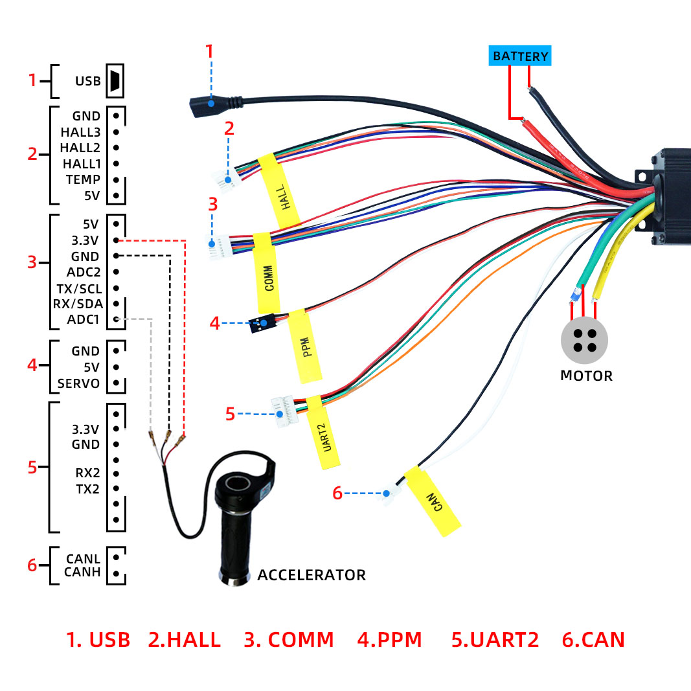
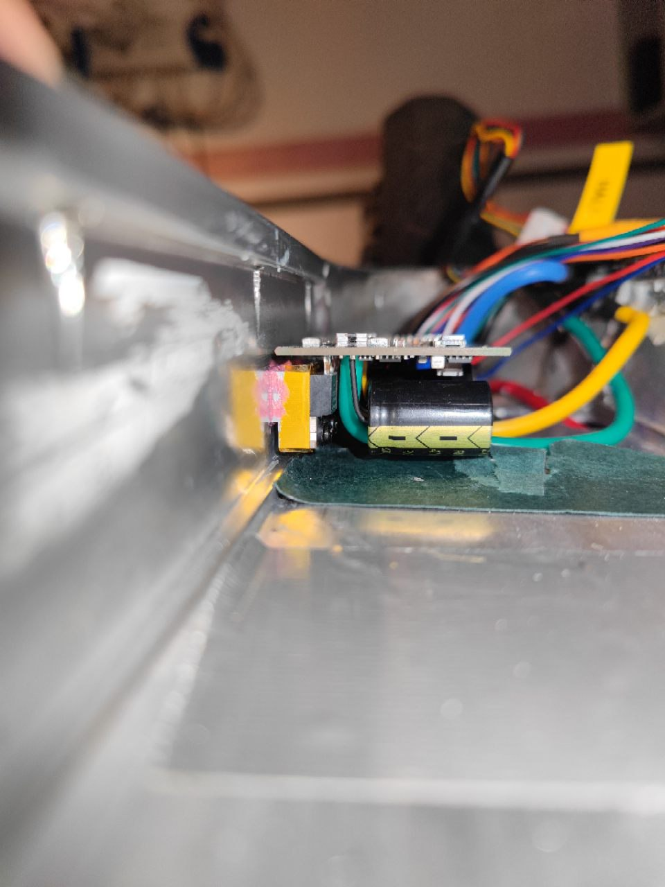
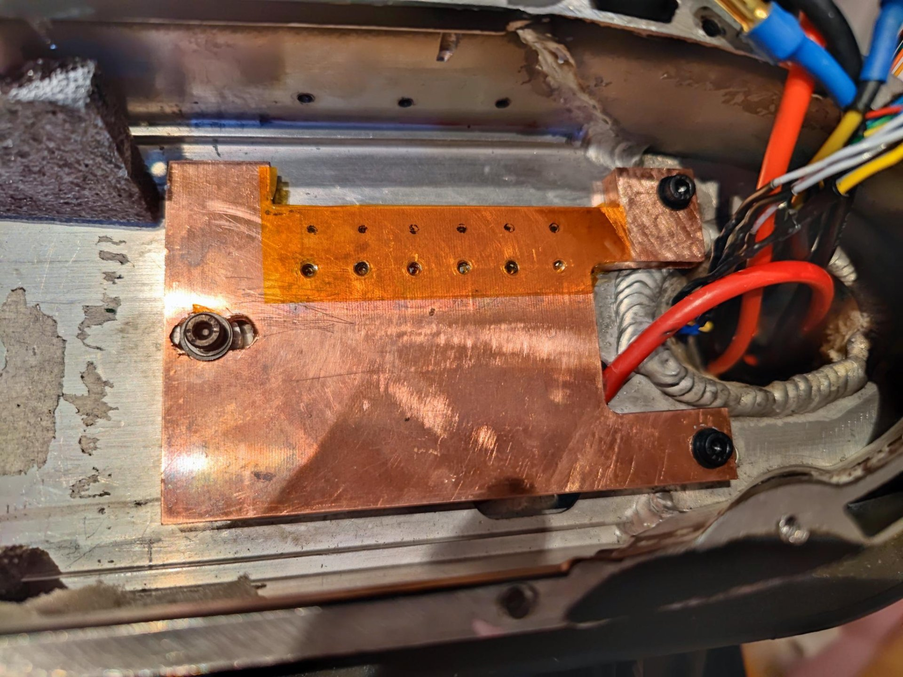
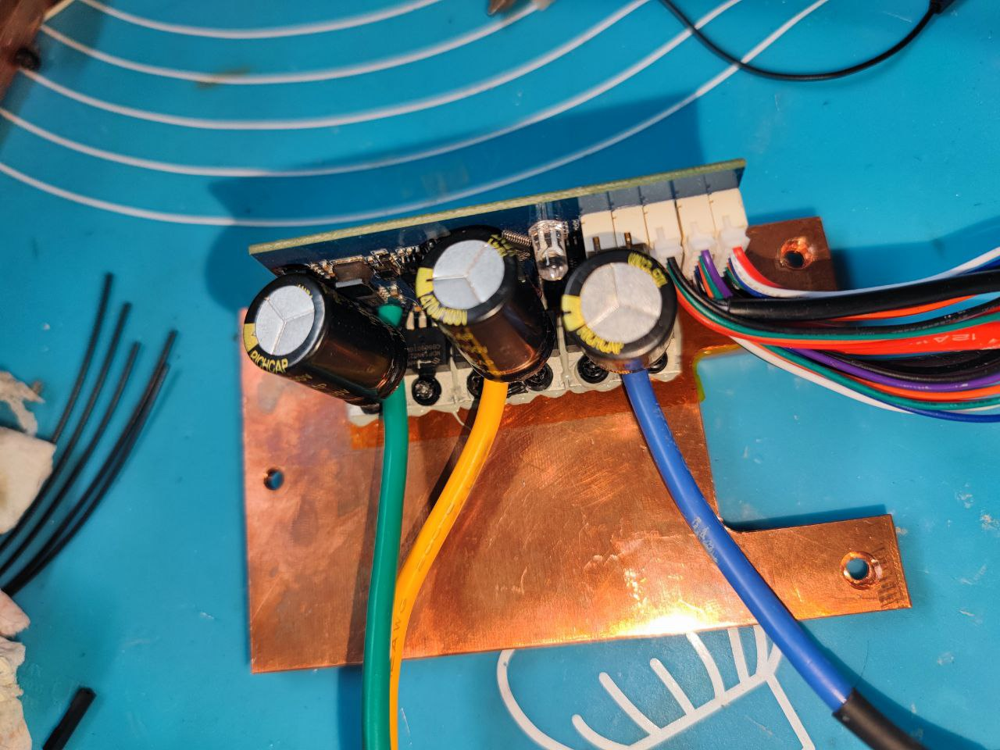
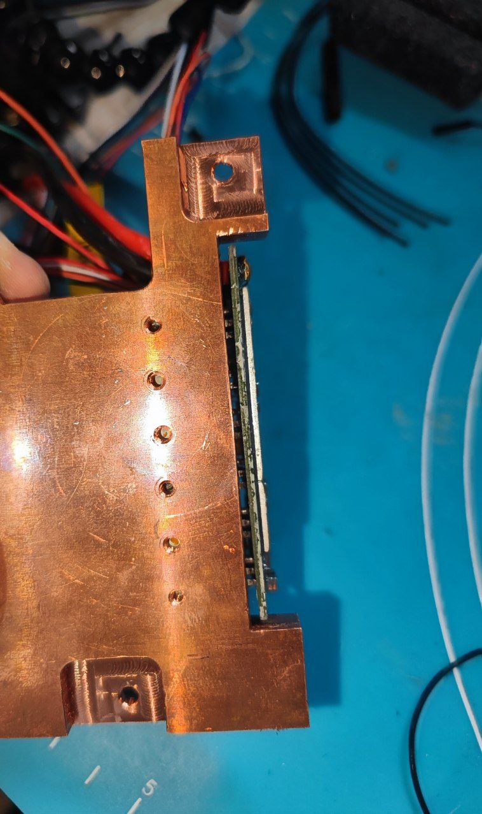

# VESC Einbau
**mit Xiaomi Display Support**

## Vorwort
Du möchtest einen VESC verwenden, aber hast dich bisher noch nicht dazu entscheiden, denn du möchtest nicht auf das Xiaomi Display verzichten und hast keine Lust auf komplizierte Verkabelung des Lichts, Bremsen, Gashebels und weiteren Komponenten. \
Dann ist mein Guide für den Einbau eines VESC in den Xiaomi Mi Scooter Pro (2) (auch andere Scooter wie G30 sind unterstützt - sind im Ablauf leicht anders - Erwähnung beachten !!), das richtige, denn hiermit können wir Kompromisslos die Verwendung eines VESC im Xiaomi ermöglichen. \

Zu diesem Beitrag <u>bitte</u> auch den [Haftungsausschluss der Nutzungsbedingungen - Pkt.8 beachten!](https://rollerplausch.com/help/terms/)

### **Was ist ein VESC?**
Ein VESC ist ein Motorsteuergerät so wie der Xiaomi ESC oder auch Controller genannt. Es gibt etliche verschiedene VESC, denn der Name "VESC" ist lediglich die Bezeichnung für die Open-Source Software des Steuergerätes. Es gibt daher etliche Motorsteuergeräte die sich VESC nennen können und ansteuerbar sind über das VESC Ökosystem. Damit auch kompatibel mit diesem Guide! \

(Ich spreche hier nicht über die VESC Firmware (SmartESC) für Xiaomi ESCs, sondern um Drittanbieter ESCs mit VESC firmware)

### **Warum ein VESC verwenden?**
Das kann mehrere Gründe haben:

* Mehr Einstellungsmöglichkeiten und Einsatzzwecke
* Höheres Leistungspotenzial, effizienter und geräuschloser durch höhere Schaltfrequenzen
* Field Weakening
* Schöne Smartphone App mit Realtime Übersicht
* Leichte Modifikation der Firmware (Open-Source)
* Große Kompatibilität mit jedem Motor (selbst ohne Hallsensor im Sensorless Modus)

### **Warum keinen VESC verwenden?**
Das kann mehrere Gründe haben:

* Bisher keine Unterstützung für das Xiaomi BMS Protokoll **(OHNE BMS KOMMUNIKATION LIMITIERT AUF 19A - KEINE VERWENDUNG!)**
* Kein Rücklicht - aufgrund fehlender Pins.
* Benötigter Aufwand, Geschick und Geduld. Auch bei Problemen die auftreten können beim Einbau und der Verwendung.
* **Risiko **besteht Schäden an den Komponenten zu hinterlassen, durch die falsche Konfiguration eines VESC.

### **Für dieses Guide verwendete Mittel:**
1x VESC (Flipsky 75100 - siehe "Kompatible VESCs") \
1x VESC Bluetooth Modul (Optional): 1x V6 NRF51 Wireless Bluetooth Modul ([AliExpress](https://s.click.aliexpress.com/e/_DcAvYD5)) \
3x 5mm Goldstecker F&M: ([AliExpress](https://s.click.aliexpress.com/e/_DkptS3h)) \
1x 7P JST 2,0mm Pitch Anschluss Kabel PH2.0 Stecker: ([AliExpress](https://s.click.aliexpress.com/e/_DFwOR2j)) \
1x 6P JST 2,0mm Pitch Anschluss Kabel PH2.0 Stecker: ([AliExpress](https://s.click.aliexpress.com/e/_DFwOR2j)) \
1x 1-3k Ohm Widerstand

Übliches Lötwerkzeug: T100 Lötkolben, Lötzinn und Lötpaste

<details>
<summary>Kompatible VESCs</summary>

<u>75100 Box:</u> \
-> Makerbase 75100 VESC ([AliExpress](https://s.click.aliexpress.com/e/_DmJxqxr) - 75€) \
-> Flipsky 75100 VESC ([Banggood](https://banggood.onelink.me/zMT7/zmenvmm2) - mit Honey Add-On um die 87-89€)

<u>75100 Alu PCB (**Absolute Empfehlung**):</u> \
-> Makerbase 75100 Alu PCB ([AliExpress](https://s.click.aliexpress.com/e/_DE9TKAl) - 95€) \
    -> Flipsky 75100 Alu PCB ([AliExpress](https://s.click.aliexpress.com/e/_DEXNhX3) - 151€)

<u>75200 Alu PCB (Top Performance):</u> \
-> Makerbase 75200 Alu PCB ([AliExpress](https://s.click.aliexpress.com/e/_Dk3ucKd) - 143€) \
-> Flipsky 75200 Alu PCB ([AliExpress](https://s.click.aliexpress.com/e/_DkxlJbj) - 266€)

<u>Weitere Empfehlungen:</u> \
Single Ubox 80v 100A Alu PCB ([Spintend](https://spintend.com/collections/frontpage/products/single-ubox-aluminum-controller-80v-100a-based-on-vesc)) \
MP2 300A 100V/150V VESC ([GitHub](https://github.com/badgineer/CCC_ESC) - Selbstbau)

*und viele weitere.*
</details>

## Schritte

<details>
<summary>Einbau und Vorbereitungen</summary>

## Vorbereitung des BLE / Display
Beim Xiaomi (Pro 2) überprüfen wir ob die BLE Firmware aktueller als 1.2.8 ist. Falls nicht updaten wir diese mit der SH Utility App. \
Beim G30 flashen wir vorerst die **Pro 1** Xiaomi BLE (0.9.0 - 1.2.2) Firmware auf das Display via ST-Link. Diese sind baugleich jedoch von der Software unterschiedlich!

Erfahrungsmäßig läuft das Skript deutlich reibungsloser mit der 1.2.8+ firmware, sollte aber auch wenn nicht möglich auf älteren BLE Versionen (bspw. Pro 1 oder G30 BLE) laufen.

## Vorbereitung der Verkabelung


**Allgemeine Verkabelung (Strom, Motor):**

Als aller erstes haben wir das Rot (+) und Schwarz (-) Kabel für die Verbindung mit dem Akku, dort löten wir einen XT60/(oder XT90) Stecker an. \
Als nächstes gibt es es die 3x Phase Kabel für den Motor, dafür verwenden wir die 5mm Goldstecker und löten diese an die Kabel des VESCs (sowie an die Kabel des Motors). \
Für die Hallsensor Kabel des Motors verwenden wir ein 6P JST PH2.0 Stecker (oder missbrauchen den mitgelieferten Hallsensor Adapter) und verbinden GND, 5V und die HALL Pins (Reihenfolge ist bei einem VESC unwichtig - diese erkennt er automatisch). TEMP lassen wir dabei jedoch frei, wenn kein Temp Sensor am Motor vorhanden ist.

**Verkabelung für das Display**

Hierfür nutzen wir den COMM Anschluss, dieser verfügt über einen 5V, 3.3V, TX, RX und GND Pin welche wir für das Display verwenden. \
Das Original Xiaomi Display Kabel für das Xiaomi BLE verfügt über Drähte für 5V, Button, Dataline und GND.

Nun wie verbinden wir diese mit dem VESC? Wir können uns hierfür die Farben der Drähte zu nutzen machen (Nur bei den original Kabel - die Aftermarket Kabel haben häufig andere Farben - in dem Fall lieber mit der Pin Belegung abgleichen).

Wir nehmen dafür einen 7P JST 2,0mm PH2.0 Stecker und verbinden ihn wie folgt: \
<span style="color:rgb(184, 49, 47);">Rot </span>auf 5V \
<span style="color:rgb(209, 213, 216);">Schwarz </span>auf GND \
<span style="color:rgb(250, 197, 28);">Gelb </span>auf TX (UART-HDX) \
<span style="color:rgb(97, 189, 109);">Grün </span>auf RX (Button) \
1k Ohm Widerstand von <span style="color:rgb(251, 160, 38);">3.3V</span> auf <span style="color:rgb(97, 189, 109);">RX (Button)</span>

Optional: Um die Spannung zu filtern verwenden wir Kondensatoren auf <span style="color:rgb(184, 49, 47);">5V</span>+<span style="color:rgb(209, 213, 216);">GND</span>, und <span style="color:rgb(251, 160, 38);">3.3V</span>+<span style="color:rgb(209, 213, 216);">GND</span>.


## Montieren des VESC
Wie ihr den VESC montiert ist euch überlassen, jedoch empfehle ich die direkte Befestigung der MOSFETs an einer Heatsink mit Kontakt am Gehäuse des Scooter.

**Beispiele:**
<details>
<summary>Flipsky 75100 - Original Heatsink</summary>

Beim Flipsky 75100 demontiert ihr vorerst das schwarze Gehäuse und nehmt die Platine heraus. An den MOSFETs befindet sich nun eine Aluminium Heatsink, welche ihr nun durch das Bohren von 3x Löchern an der Seite des Scooters befestigen könnt.


</details>

<details>
<summary>Flipsky 75100 - Custom Heatsink</summary>




</details>

</details>


<details>

<summary>Konfiguration des VESC</summary>


Erstmals müssen wir VESC Tool von der VESC Project Webseite ([VESC Project](https://vesc-project.com/)) herunterladen, um den Download zu erhalten müssen wir vorerst ein Konto erstellen und das kostenlose Paket "kaufen". Danach erhalten wir Zugriff auf die Downloads und wir laden nun das für unser Betriebssystem entsprechende VESC Tool herunter.

Um mit dem VESC Tool den VESC anzusteuern müssen wir diesen vorher mit dem mitgelieferten USB Kabel an einen Computer anschließen, alternativ geht auch die Verbindung über Bluetooth.
## Firmware Upgrade auf VESC 6.0
Falls unser noch mit VESC 5.3 Firmware ausgeliefert wurde, müssen wir diesen vorest auf VESC 6.0 updaten, denn wir benötigen für die Integration des Xiaomi/NineBot Display (BLE Modul) das neue Lisp-Skript Feature, welches erlaubt in der Programmiersprache Lisp geschriebene Skripte auszuführen.

Damit wir den VESC 6.0 upgraden können benötigen wir erstmals die neue Firmware. Diese können wir uns entweder selbst kompilieren oder wir laden sie herunter von GitHub.

<u>Jetzt fängt der eigentliche Firmware Upgrade an.</u>

* Verbinde dich mit VESC Tool mit dem VESC über den AutoConnect Knopf
* Updaten wir den Bootloader
* Gehe in den Firmware Tab
* Klicke auf den Reiter "Bootloader"
* Wähle "generic" aus (oder die andere übrige Auswahl)
* Drücke auf den Upload Button (Knopf mit Pfeil nach unten)
* Warte bis der Vorgang abgeschlossen ist.
* Updaten wir die eigentliche Firmware
* Klicke auf den Reiter "Included Files" und aktiviere die Option "Show non-default firmwares".
* Wähle nun deine Hardware Version aus (Flipsky 75100 V2: 75_100_V2, Ubox Single: UBOX_SINGLE_100)
-> Beim ersten Mal: Firmware direkt von [GitHub](https://github.com/vedderb/vesc_fw_archive/tree/main/6.00/) herunterladen und bei "Custom files" auswählen.
* Wähle nun die Firmware: VESC_default_no_hw_limits.bin (damit entsperren wir auch jegliche Limitierungen - für Power User nützlich)
* Drücke auf den Upload Button (Knopf mit Pfeil nach unten)
* Warte auf den Abschluss des Uploads und auf den Dialog. Warte bis der VESC sich neugestartet hat und verbinde dich nun wieder. (10+ Sekunden)
* Nun sollte dein VESC mit der aktuellen VESC 6.0 laufen.

## **Allgemeine Konfiguration des VESC**

**ACHTUNG**: Der Motor muss frei liegen! Der Motor wird sich beim Setup nämlich anfangen zu drehen und erschrecke dich nicht vor den Geräuschen!

* Verbinde dich mit VESC Tool mit dem VESC
* Drücke den "Setup Motors FOC" Knopf
* Beim Dialog "Load default Parameters" auf "No".
* Bei der Auswahl des Motors auf "Generic" und auf "Next", dann "Large Outrunner" und auf Next, beim Dialog auf "Yes".
* Bei der Konfiguration des Akku beim Feld "Battery Cells Series" die Anzahl der Zellen in Serie angeben (36V - 10 Stück, 48V - 13S Stück ... usw), bei "Battery capacity" die Amperestunden deines Akkus. Nun ist wichtig "Advanced" aktivieren. Bei "Battery Current Regen" die maximalen Ampere die durch Regeneration zurück in den Akku fließen dürfen. Bei "Battery Current Max" die maximalen Ampere die aus dem Akku gezogen dürfen werden (bspw. 30A). Dann auf Next.
* Direct Drive aktivieren (wir haben schließlich keine Gänge an unserem Scooter), den Durchmesser des Rads und die Anzahl der Magneten angeben (Das ist nicht so wichtig - denn dies dient lediglich der Messung der Geschwindigkeit). Nun können wir auf "Run Detection" drücken. Beim Dialog auf "No". denn wir nutzen nur einen Controller, bei mehreren auf "Yes".
* Nun startet der Erkennungsprozess und der Motor fängt an zu fiepsen und sich zu drehen.
* Nun können wir auf "FWD" drücken und erkennen ob der Motor sich falsch herum dreht oder nicht, wenn er sich falsch herum dreht dann aktiviere den "Inverted" Regler, der wird den Motor nun richtig herum drehen lassen. Dann auf "Finish".
* Wir sind nun mit den Basics fertig und können mit der Einbindung des Displays weitermachen.

</details>

<details>
<summary>Installation und Konfiguration der Display Integration</summary>

Installieren ist in dem Fall dass wir das folgende Lisp Skript in unseren VESC Tool eintragen und ihn dieses ausführen lassen.
Dafür müssen wir uns erstmal das Skript in die Zwischenablage kopieren.
[URL unfurl="true"]https://github.com/m365fw/vesc_m365_dash/blob/main/m365_dash.lisp[/URL] ([Repository](https://github.com/m365fw/vesc_m365_dash))
Um den Text in roher Fassung auszugeben drücken wir auf "Raw" und können uns bedenkenlos alles kopieren.

*Folgende Features sind implementiert:*

* Gashebel drücken beschleunigt deinen Motor ab einer Geschwindigkeit von 1km/h
* Bremshebel drücken bremst mit deinem Motor ab
* Langes drücken des Button schaltet das Display ab (jedoch nicht den VESC selbst!), einmal drücken schaltet ihn wieder an.
* Einmal drücken schaltet das Licht an und aus.
* Doppelt drücken wechselt den Speedmodi.
* Bremse halten und doppelt drücken sperrt den Scooter - erneuter Ablauf macht dieses wieder rückgängig.
* Anzeige des Batteriestandes im Idle (0 km/h) als Geschwindigkeitsanzeige

**Installation:**

* Verbinde den vorher vorbereiteten Displaystecker mit dem COMM Anschluss.
* Verbinde dich nun mit VESC Tool mit dem VESC.
* Drücke auf den Tab "VESC Dev Tools", gehe nun auf den Reiter "Lisp"
* Füge nun das Skript aus der Zwischenablage in das große Textfeld ein
* Klicke nun auf Upload und in der Konsole sollte nun eine Nachricht erscheinen
* Begutachte nun dein Display und schaue ob nun der Batteriestand ersichtlich ist
* Fertig. Nun kannst du dein Display verwenden.


<u>Allgemeine Einstellungen  **(**[Zeile](https://github.com/m365fw/vesc_m365_dash/blob/49545cf5943d9a446275e15d7ef8bc05ec63004e/m365_dash.lisp#L18)**)**:</u>
```lisp
(define light-default 0)
(define show-faults 1)
(define show-batt-in-idle 1)
(define min-speed 1)
(define button-safety-speed (/ 0.1 3.6)) ; disabling button above 0.1 km/h (due to safety reasons)
```

*(0 steht für DEAKTIVIERT, 1 steht für AKTIVIERT)*

"light-default" stellt ein ob das Licht standardmäßig an sein soll.
"show-faults" aktiviert die Anzeige für Fehler im Display, sobald ein Fehler im VESC auftritt.
"show-batt-in-idle" aktiviert die Anzeige der Batterieprozent im Idle.
"min-speed" gibt die minimale Geschwindigkeit an in der er denken soll dass man nicht fährt (Idle-Modus). Empfehlenswert auf 1 lassen!

<u>Einstellen der Geschwindigkeitsmodi** (**[**Zeile**](https://github.com/m365fw/vesc_m365_dash/blob/49545cf5943d9a446275e15d7ef8bc05ec63004e/m365_dash.lisp#L24)</u>**<u>):</u>**
```lisp
(define eco-speed (/ 7 3.6))
(define eco-current 0.6)
(define eco-watts 400)
(define drive-speed (/ 17 3.6))
(define drive-current 0.7)
(define drive-watts 500)
(define sport-speed (/ 21 3.6)) ; or 400
(define sport-current 1.0)
(define sport-watts 700) ; or 1500000

(define secret-enabled 1)
(define secret-eco-speed (/ 25 3.6))
(define secret-eco-current 0.6)
(define secret-eco-watts 1500000)
(define secret-drive-speed (/ 45 3.6))
(define secret-drive-current 0.8)
(define secret-drive-watts 1500000)
(define secret-sport-speed (/ 400 3.6))
(define secret-sport-current 1.0)
(define secret-sport-watts 1500000)
```

Dafür haben wir "speed", "current" und "watt", sowie folgend den Namen des Modi. Bspw. "speed-sport".
Speed gibt die maximale Geschwindigkeit an. Watt gibt die maximalen Watt des Modis an, Current gibt die Prozentualen Phase Ampere an (welche als maximal eingestellt sind).
Eco ist der Gehmodus, Drive der D Modus, Sport der S Modus. Secret ist der geheime Modus der durch die Kombination: Gas+Bremse gedrückt, 2x Knopf aktiviert werden kann.

<u>Kalibration des Gaspedals und der Bremse (</u>[<u>Zeile</u>](https://github.com/m365fw/vesc_m365_dash/blob/49545cf5943d9a446275e15d7ef8bc05ec63004e/m365_dash.lisp#L7)<u>):</u>
```lisp
;Calibrate throttle min max
(define cal-thr-lo 41.0)
(define cal-thr-hi 167.0)
(define thr-deadzone 0.05)

;Calibrate brake min max
(define cal-brk-lo 39.0)
(define cal-brk-hi 179.0)
(define brk-deadzone 0.05)
(define brk-minspeed 1)
```

Dieser Schritt ist nicht dringend nötig, aber empfehlenswert!

Vorerst aktivieren wir "Poll status" in VESC Tool, damit wir in der rechten Box die aktuellen Werte erkennen für die Kalibration.

Bei "Calibrate throttle min max" können wir den Erkennungsbereich des Gashebels einstellen, das wird von nöten wenn sich der Wert "throttle" nicht im Bereich 0.0 - 1.0 befindet. Selbe gilt für "Calibrate brake min max".


</details>
